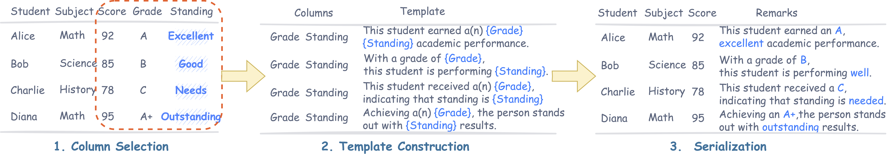

# Same Content, Different Representations: A Controlled Study for Table QA

This repository contains the data construction and evaluation pipeline used in the paper:

> **Same Content, Different Representations: A Controlled Study for Table QA**  
> Yue Zhang, Seiji Maekawa, Nikita Bhutani  
> arXiv: [2509.22983](https://arxiv.org/abs/2509.22983)
>
> <p align="center" width="100%">
<a ></a>
</p>

## ⭐️ Key Contributions
1. Controlled, same-content representation framework + diagnostic benchmark – Presents a verbalization pipeline that converts structured tables into semistructured counterparts while preserving semantics, enabling one-to-one comparisons. Builds a diagnostic benchmark that decomposes difficulty along four axes—table size, table joins, query complexity, and schema quality—for targeted analysis of robustness.    
2. Cross-paradigm empirical study with clear trade-offs – Systematically evaluates NL2SQL, LLM, and hybrid methods across BIRD, MMQA, and TableEval. Finds that NL2SQL attains highest accuracy on structured inputs but drops roughly 30–45 percentage points on semistructured ones (e.g., XiYan 69.55 → 24.08, −45.47 pp), LLMs degrade only ~1–3.5 pp, and hybrids fall by <5 pp while remaining most robust under representation shifts; performance further worsens with longer tables, more complex queries, and noisy schemas.      
3. Evaluation protocol and practical guidance for deployment – Adopts an LLM-as-judge procedure to assess semantic correctness beyond brittle exact-match metrics, and distills actionable guidance: prefer NL2SQL for clean, structured and join-heavy settings; favor hybrids for semistructured or schema-noisy data; use LLMs when flexibility is needed but peak precision is not.

The code focuses on building semi-structured versions of table QA datasets, verbalizing tables, and evaluating model performance under different representations.

The main components are:

1. Column usage analysis on raw tables  
2. Column selection & combination generation with an LLM  
3. Template generation with an LLM  
4. Table verbalization using templates  
5. QA evaluation with (semi-)structured prompts  
6. NL2SQL baseline using SQLite + LLM-generated SQL  


## 🛠️ Setup
The required packages are listed in `requirements.txt`.
The following setup is based on `conda` to manage the environment; if you do not have `conda` installed, please follow the [official installation instructions](https://docs.conda.io/projects/conda/en/latest/user-guide/install/index.html) if you want to run the code under the same conditions as ours.
To simulate the environment, on your terminal simply run:

```
conda create -n repairtqa python=3.13
conda activate repairtqa
pip install -r requirements.txt
```

---
## 🚀 Quick Tour
Five ready-to-use bash scripts are included for quick runs:

1.	**run_pipeline.sh** – runs the full data construction pipeline   <br>
		(column matching → column selection → template generation → verbalization)

2.	**run_gpt.sh** – runs QA inference with GPT models   <br>
		(evaluates both semi-structured and structured versions)

3.	**run_gemini.sh** – runs QA inference with Gemini via LiteLLM    <br>
		(parallel to GPT evaluation)

4.	**run_nl2sql_example.sh** – runs the NL2SQL baseline on the provided example data    <br>
		(generates SQL from natural language and executes locally with SQLite)

5.	**run_eval.sh** – runs LLM-based semantic evaluation on model predictions  <br>
		(checks whether the predicted answers are semantically equivalent to the ground truth)

You can simply execute them in order:

```bash
bash run_pipeline.sh
bash run_gpt.sh
bash run_gemini.sh
bash run_nl2sql_example.sh
bash run_gpt_eval_example.sh
```

## 📂 Detailed Instructions

### 🧾 Original Datasets
| ID  | OSS Component Name | Modified | Copyright Holder | Upstream Link | License  |
|-----|----------------------------------|----------|------------------|-----------------------------------------------------------------------------------------------------------|--------------------|
| 1 | BIRD | No | Alibaba Research | [link](https://github.com/AlibabaResearch/DAMO-ConvAI/tree/main/bird) | CC BY-SA 4.0 |
| 2 | MMQA | No | Westlake University | [link](https://github.com/WuJian1995/MMQA) | Not specified | 
| 3 | TableEval | No | Beijing Wenge Technology and State Key Laboratory of Multimodal Artificial Intelligence Systems | [link](https://github.com/wenge-research/TableEval) | Apache-2.0 license | 


### 🧪 Dataset-Specific Preprocessing & Diagnostic Splits

This repository also includes lightweight preprocessing scripts that construct
diagnostic splits from the original BIRD, MMQA, and TableEval datasets.  
All scripts produce a **unified JSON schema** that is later consumed by the
verbalization and QA evaluation pipeline.

We provide three bash entry points:

- `scripts/run_bird_subset_selection.sh`
- `scripts/run_tableeval_subset_selection.sh`
- `scripts/run_mmqa_subset_selection.sh`

Each script assumes that you have already downloaded the corresponding
original dataset (see the _Original Datasets_ table above) and placed it
under `data_selection/…` with the expected layout.

---

#### 1. BIRD diagnostic splits (S1–S5)

We follow the paper’s diagnostic design and construct four subsets of BIRD:

- **S1 – Short, Simple Lookup**  
  Single-table, non-aggregated, non-join, simple projection queries on short tables.
- **S3 – Short, Compositional**  
  More complex SQL patterns on short tables (e.g., joins / aggregations).
- **S4 – Long, Simple Lookup**  
  Same as S1 but on long tables (more rows).
- **S5 – Long, Compositional**  
  Same as S3 but on long tables.

All of these are built from the original BIRD train/dev splits using one
script:

```bash
bash scripts/run_bird_subset_selection.sh
```
By default, the script expects the following directory structure:
```
data_selection/
  BIRD/
    bird_pipeline.py
    train/
      train.json
      train_tables.json
      train_databases/<db_id>/<db_id>.sqlite
    dev_20240627/
      dev.json
      dev_tables.json
      dev_databases/<db_id>/<db_id>.sqlite
```
You may point BIRD_ROOT inside scripts/run_bird_splits.sh to a different location if needed.

After running the script, the following files are produced:
```
data_selection/BIRD/splits/
  bird_S1_short_lookup_with_answer.json
  bird_S3_short_compositional_with_answer.json
  bird_S4_long_lookup_with_answer.json
  bird_S5_long_compositional_with_answer.json
```
#### 2. TableEval diagnostic split (S2 – Simple Query)

For TableEval, we focus on the “简单查询 (simple query)” sub-task and
exclude nested / hierarchical tables. The preprocessing script extracts
a flat-table subset and converts it into the same unified format.
Run
```bash
bash scripts/run_tableeval_subset_selection.sh
```
By default, the script expects the following directory structure:
```
data_selection/TableEval/
  TableEval-meta.jsonl   # table metadata, markdown, context, types
  TableEval-test.jsonl   # questions and answers
  data_selection.py
```
Output:
```
data_selection/TableEval/
  TableEval_S2_simple_short_flat.json
```

#### 3. MMQA diagnostic splits (M1/M2 – Multi-table, Short/Long)
For MMQA, we construct two diagnostic splits focusing on multi-table reasoning and table size:
	* M1 – Short, Multi-table:
samples where at least two tables are “short” (e.g., ≤ 100 rows).
	* M2 – Long, Multi-table:
samples where at least two tables are “long” (e.g., ≥ 101 rows).

We assume that you have MMQA into a synthesized multi-table JSON data, stored as:
```
data_selection/MMQA/
  Synthesized_three_table.json   # samples with 3 tables
  Synthesized_two_table.json     # samples with 2 tables
  data_selection.py
```
Then run:
```
bash scripts/run_mmqa_subset_selection.sh
```
This generates:
```
data_selection/MMQA/splits/
  filtered_three_table_No_Rules.json   # random baseline subset
  filtered_two_table_No_Rules.json
  MMQA_M1_short_multi.json             # M1: short, multi-table
  MMQA_M2_long_multi.json              # M2: long, multi-table
```

In summary, after running:
```
bash scripts/run_bird_subset_selection.sh
bash scripts/run_tableeval_subset_selection.sh
bash scripts/run_mmqa_subset_selection.sh
```
you obtain BIRD, TableEval, and MMQA subsets that all share a common Table QA JSON format, which can be directly fed into the subsequent verbalization and evaluation pipeline described below.


### Data Format

All scripts assume an input JSON file that is a **list of samples**.

A simplified sample:

```json
{
  "id_": "sample_001",
  "db": "some_db_name",
  "Question": "What is the total revenue in 2020?",
  "answer": [["1000"]],
  "SQL": "SELECT revenue FROM table_1 WHERE year = 2020;",
  "table_names": ["table_1", "table_2"],
  "tables": [
    {
      "table_columns": ["year", "revenue"],
      "table_content": [
        [2019, 900],
        [2020, 1000]
      ]
    },
    {
      "table_columns": ["col_a", "col_b"],
      "table_content": ["..."]
    }
  ]
}
```

### ⚙️ Data Transformation
This section includes four main steps:
	1.	table_match → `src/matched_columns_analysis_s1.py`
	2.	column selection → `src/column_selection_s2.py`
	3.	template generation → `src/template_generation_s3.py`
	4.	verbalization → `src/verbalization_col_s4.py`

#### Step1: Table Match
Analyze which columns in each table are actually mentioned in the SQL, and compute match statistics.

**Usage:**

```bash
python matched_columns_analysis_s1.py \
  --input /path/to/data.json \
  --output /path/to/table_match.csv \
  --mode table_match
```

**Arguments:**

- `--input`: path to the input JSON file (list of samples)  
- `--output`: output CSV path  
- `--mode`: one of:  
  - `table_match`: per-table matched/unmatched columns + examples  
  - `high_freq`: high-frequency columns across samples  
  - `unique_table`: count how many times each table appears  
- `--save_csv` (flag, only for `unique_table`): whether to save CSV  

The `table_match` CSV is used by later steps.

#### Step2: Column Selection
Call GPT to classify which columns are important and generate column combinations.

**Usage:**

```bash
python column_selection_s2.py \
  --csv_in table_match.csv \
  --csv_cols_out col_labels.csv \
  --csv_tmpl_out col_combinations.csv \
  --prompt_template_path ./prompts/column_selection.txt \
  --model gpt-4o-2024-11-20 \
  --api_key YOUR_OPENAI_API_KEY
```

**Arguments:**

- `--csv_in`: input CSV from Step 1 (includes `matched_columns`, `unmatched_columns`, `column_examples`, etc.)  
- `--csv_cols_out`: output CSV with per-column labels (`YES` / `NO`, etc.)  
- `--csv_tmpl_out`: output CSV with column combinations (`column1`, `column2`, …)  
- `--prompt_template_path`: path to the prompt template for column selection  
- `--model`: OpenAI model name (default: `gpt-4o-2024-11-20`)  
- `--api_key`: OpenAI API key  
- `--query_column` (flag): only use `matched_columns` as candidates  
- `--exclude_query_column` (flag): only use `unmatched_columns` as candidates  


#### Step 3: Template Generation
Generate natural language templates (`template1`–`template5`) for each column combination.

**Usage:**

```bash
python template_generation_s3.py \
  --csv_templates col_combinations.csv \
  --csv_matched table_match.csv \
  --prompt_template_path ./prompts/template_generation.txt \
  --api_key YOUR_OPENAI_API_KEY \
  --model gpt-4o-2024-11-20 \
  --max_tokens 512
```

**Arguments:**

- `--csv_templates`: CSV with `db`, `table`, `column1`, `column2`, … (from Step 2)  
- `--csv_matched`: CSV with `column_examples` (for value examples)  
- `--prompt_template_path`: prompt template file for template generation  
- `--api_key`: OpenAI API key  
- `--model`: OpenAI model name (default: `gpt-4o-2024-11-20`)  
- `--max_tokens`: completion token limit per GPT call  
- `--all_columns` (flag): alternate mode that generates templates for all columns  

The script fills or creates `template1`–`template5` columns in the CSV.


#### Step 4: Verbalization
Use generated templates to verbalize table rows into natural language descriptions.

**Usage (column-based verbalization):**

```bash
python verbalization_col_s4.py \
  --data_path /path/to/data.json \
  --template_path /path/to/col_combinations.csv \
  --output_path /path/to/verbalized.json \
  --failed_path /path/to/failed_items.json \
  --no_sql
```

**Arguments:**

- `--data_path`: input JSON with original samples  
- `--template_path`: CSV with `db`, `table`, `column*`, `template*`  
- `--output_path`: output JSON with verbalized tables  
- `--failed_path`: JSON file to store failed samples  
- `--no_sql`: if set, skip executing SQL and keep original answer; otherwise, run SQL against `raw_tables` to recompute `answer`  

Typical new fields in the output JSON:

- `tables[i]["paragraph"]`: concatenated verbalized text for each table  
- `raw_tables`: cleaned tables for SQL execution  
- `used_keys`: mapping from table name to used column names  
- `verbalized_data`: list of `{"text": para}` segments  

You may also have an **all-columns verbalization** variant (e.g., `verbalization_row_s4_1.py`) that verbalizes all columns; its CLI is similar but may include a `--ratio` argument to control the fraction of rows to verbalize.


---

### 🧠 QA Inference

This section evaluates QA performance on different representations.

#### 1. Vanilla LLM QA (GPT/Gemini)
Run GPT-based QA on different input formats and compute exact match (EM) and partial match (PM).

**Usage:**

```bash
python llm_infer_s5.py \
  --input_file /path/to/verbalized.json \
  --output_file /path/to/semi_structured_results.jsonl \
  --structured_output_file /path/to/structured_baseline_results.jsonl \
  --data_type semi-structured \
  --model gpt-4o-2024-11-20 \
  --provider gpt \
  --max_samples 500
```

**Arguments:**

- `--input_file`: JSON file with verbalized samples (has `tables` and `verbalized_data`)  
- `--output_file`: JSONL file for the chosen `data_type`  
- `--structured_output_file` (optional): if set, also runs a structured-only baseline using `raw_tables`  
- `--data_type`: one of:  
  - `semi-structured`: tables + verbalized text + question  
  - `structured`: tables only + question  
  - `unstructured`: text only + question  
- `--model`: model name (e.g., `gpt-4o-2024-11-20`, `o4-mini-2025-04-16`)  
- `--max_samples`: maximum number of samples to evaluate (optional)  
- `--provider`:  
  - `gpt`: use OpenAI via the official client  
  - `gemini`: use Gemini via LiteLLM (`litellm.completion`)  
  - `custom`: reserved for extension  

Each output line (JSONL) looks like:

```json
{
  "id": "sample_001",
  "question": "...",
  "ground_truth": "..."
  "prediction": "... or structured type ...",
  "error": null,
  "EM": 1,
  "PM": 1
}
```

EM/PM are computed using simple normalization (`normalize` + `eval_em_pm` in the script).


#### 2. NL2SQL Baseline

Build an in-memory SQLite database from each sample, ask an LLM to generate a SQL query, execute the query locally, and return rows.

The script is **SELECT-only** and will reject non-SELECT statements.

**Single-sample usage:**

```bash
python nl2sql_baseline_s6.py \
  --input_json /path/to/verbalized.json \
  --index 0 \
  --model gpt-4o-mini \
  --openai_api_key YOUR_OPENAI_API_KEY
```

This prints a single JSON object to stdout.

**Batch usage:**

```bash
python nl2sql_baseline_s6.py \
  --input_json /path/to/verbalized.json \
  --model gpt-4o-mini \
  --openai_api_key YOUR_OPENAI_API_KEY \
  --output_file /path/to/nl2sql_results.jsonl
```

**Arguments:**

- `--input_json`: input JSON file (list of samples)  
- `--index`: if provided, run only this sample index and print a single JSON result  
- `--model`: OpenAI model name (e.g., `gpt-4o-mini`, `gpt-4o`)  
- `--openai_api_key`: API key (optional if `OPENAI_API_KEY` is set)  
- `--no_refine`: if set, disable one-step refinement when SQL execution fails  
- `--no_raw`: if set, do not use `raw_table` / `raw_tables`, but instead top-level `tables`  
- `--output_file`: JSONL file for batch mode (default: `<input_json>_results.jsonl`)  

Each result JSON object contains:

```json
{
  "id": "sample_001",
  "question": "...",
  "ground_truth": "...",
  "sql": "SELECT ...",
  "note": null,
  "rows": [["..."], "..."],
  "columns": ["col1", "col2", "..."],
  "prediction": [["..."], "..."],
  "error": null,
  "_index": 0
}
```

- `sql`: raw SQL produced by the LLM (without fenced block)  
- `note`: optional comment appended after `<!--note-->` by the LLM  
- `rows` / `columns`: direct SQLite execution results  


#### 3. LLM-based evaluation

Evaluate model predictions using an LLM-based semantic correctness check.
This script asks a GPT model (e.g., gpt-4o) whether the predicted answer is semantically equivalent to the ground-truth answer, and records "CORRECT" or "INCORRECT" for each sample.

```bash
python gpt_evaluator_s7.py \
  --input_file "$INPUT_FILE" \
  --output_file "$OUTPUT_FILE" \
  --model "$MODEL" \
  --total_length "$TOTAL_LENGTH"
```

**Arguments:**

- `--input_file`: path to a JSONL file containing samples with fields  
  `{"prediction": ..., "ground_truth": ...}`
- `--output_file`: path to save the evaluated results (JSONL)
- `--model`: model name to use for evaluation (e.g., `gpt-4o`, `gpt-4o-mini`)
- `--api_key`: optional OpenAI API key (if not already set via `OPENAI_API_KEY`)
- `--total_length`: optional number of samples to show in the progress bar

**Output format:**

```json
{
  "id": "sample_001",
  "question": "...",
  "ground_truth": "...",
  "prediction": "...",
  "gpt_eval": "CORRECT"
}
```

---

## 🧾 Notes

- The pipeline is dataset-agnostic as long as you conform to the expected JSON schema.  
- For reproducibility in experiments:  
  - Fix a specific model version (e.g., `gpt-4o-2024-11-20`).  
  - Freeze prompt templates in `./prompts`.  
  - Use a fixed random seed wherever relevant (e.g., in verbalization scripts).  


---

## 📚 Citation

If you use this codebase or dataset in academic work, please cite:

```bibtex
@article{Zhang2025SameCD,
  title={Same Content, Different Representations: A Controlled Study for Table QA},
  author={Yue Zhang and Seiji Maekawa and Nikita Bhutani},
  journal={ArXiv},
  year={2025},
  volume={abs/2509.22983},
  url={https://api.semanticscholar.org/CorpusID:281674326}
}
```

## 📜 Disclosure
Embedded in, or bundled with, this product are open source software (OSS) components, datasets and other third party components identified below. The license terms respectively governing the datasets and third-party components continue to govern those portions, and you agree to those license terms, which, when applicable, specifically limit any distribution. You may receive a copy of, distribute and/or modify any open source code for the OSS component under the terms of their respective licenses, which may be BSD 3 clause license and Apache 2.0 license. In the event of conflicts between Megagon Labs, Inc., license conditions and the Open Source Software license conditions, the Open Source Software conditions shall prevail with respect to the Open Source Software portions of the software. 
You agree not to, and are not permitted to, distribute actual datasets used with the OSS components listed below. You agree and are limited to distribute only links to datasets from known sources by listing them in the datasets overview table below. You are permitted to distribute derived datasets of data sets from known sources by including links to original dataset source in the datasets overview table below. You agree that any right to modify datasets originating from parties other than Megagon Labs, Inc. are governed by the respective third party’s license conditions. 
All OSS components and datasets are distributed WITHOUT ANY WARRANTY, without even implied warranty such as for MERCHANTABILITY or FITNESS FOR A PARTICULAR PURPOSE, and without any liability to or claim against any Megagon Labs, Inc. entity other than as explicitly documented in this README document. You agree to cease using any part of the provided materials if you do not agree with the terms or the lack of any warranty herein.
While Megagon Labs, Inc., makes commercially reasonable efforts to ensure that citations in this document are complete and accurate, errors may occur. If you see any error or omission, please help us improve this document by sending information to contact_oss@megagon.ai.